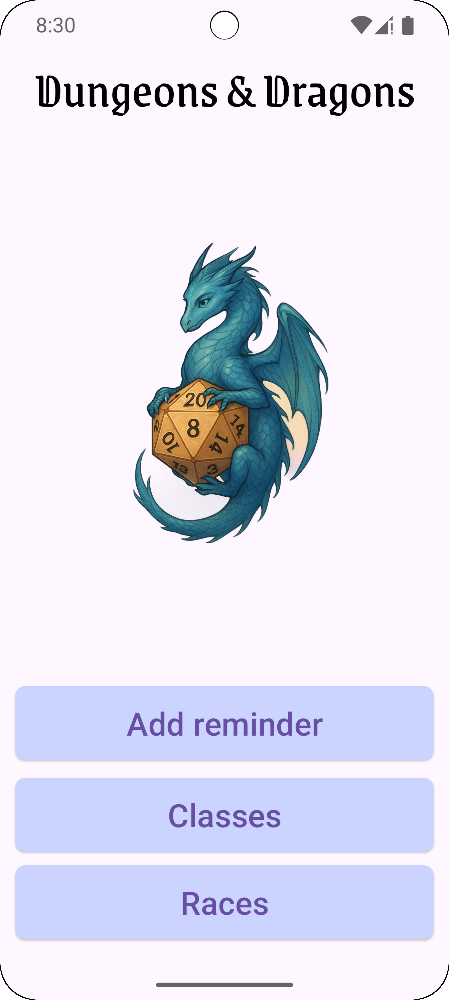
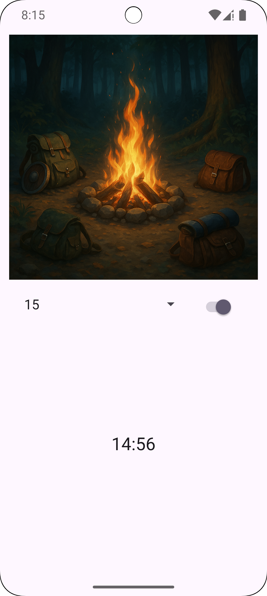
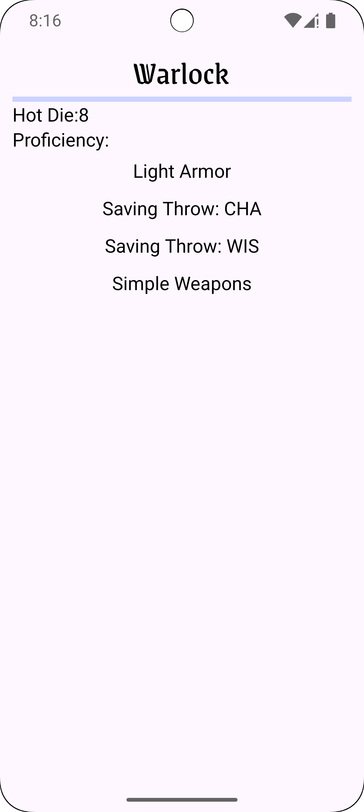
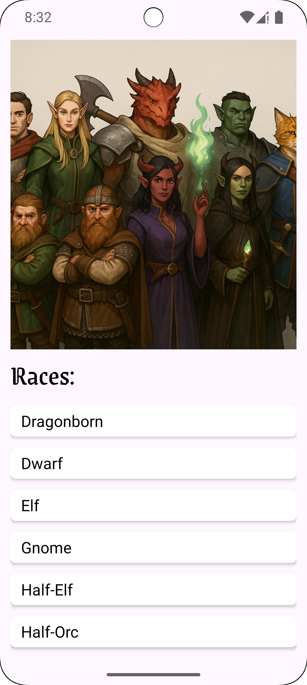
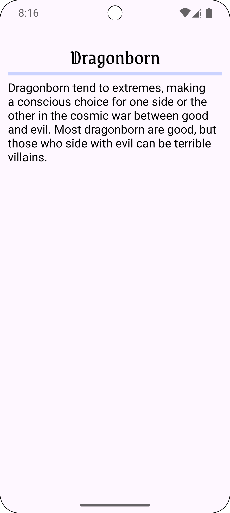

# Diseon
## Project Overview
Diceon is a custom Android application created for tabletop role-playing game (TTRPG) enthusiasts, especially those who enjoy Dungeons & Dragons. The app provides a helpful set of tools both for players and Dungeon Masters (DMs). It combines functionality like timers, class and race references, and smooth navigation to enhance gameplay and assist with session management.
The application includes the following main features:
* A reminder timer screen with image, minute selection via Spinner, and a Start/Stop switch. Once the timer finishes, a notification appears with the message “It’s time” and a Snooze button.
* A class list screen that fetches D&D classes from the internet and displays them below a header image. This screen includes MotionLayout transitions that collapse the image when the user scrolls.
* A class detail screen displaying selected class name, hot dice (number of dice used), and a list of proficiencies using RecyclerView.
* A race list screen with similar structure to the class list. Clicking on a race opens a race detail screen with the race name and its description.
* Displays a “No data” message on list screens when the device has no internet connection.
* Uses a custom font and includes a custom app icon.
* Checks Android API version to request permission for notifications where necessary.

# Key Development Areas
## Application Architecture
* Built with the MVVM pattern, using ViewModel, LiveData, and Repository architecture.
* Employs the Navigation Component for safe and structured screen transitions.
* Clear separation of UI and business logic.
## UI and Layout
* MotionLayout used for animated transitions on scroll.
* Responsive design with ConstraintLayout and RecyclerViews.
* Custom styling using downloaded fonts and a branded app icon.
* Clear “No data” indication in offline mode.
## API Connectivity and Data Persistence
* Retrieves class and race data from an API and updates the UI dynamically.
* Displays fallback UI in case of no network connection.
* Efficient use of ViewModel and LiveData for observing data changes.
## Hardware Integration
* Integrates with Android’s alarm and notification system.
* Displays a notification with “Snooze” action after the timer ends.
* Requests notification permissions dynamically depending on the Android version.
## User-Based Functionality
* Users can customize reminder duration with Spinner and activate it with a Switch.
* Tap interactions lead to detailed screens for classes and races.
* Timer feature assists players and DMs in tracking time-sensitive events during gameplay.

# Milestone Schedule
1. Design Document & Navigation. Create project plan, implement basic navigation between main screens.
2. Reminder Timer. Add Spinner selection, Switch activation, timer logic, and basic notification.
3. Class List Screen. Fetch from API, display using RecyclerView and MotionLayout transition.
4. Class Detail Screen. Show class name, hot dice, and proficiencies in RecyclerView.
5. Race List Screen. Load races from API and display details on click.
6. Race Detail Screen. Show class name and description.
7. Offline Support and Error Handling.Handle offline state in class and race lists: Display “No data” when no internet is available.
8. Notification & Permission Logic. Show timer notifications with “Snooze” action; handle API-level permissions.
9. Add design. Add custom font, app icon, UI tweaks, and error handling.

# Screenshots
     
